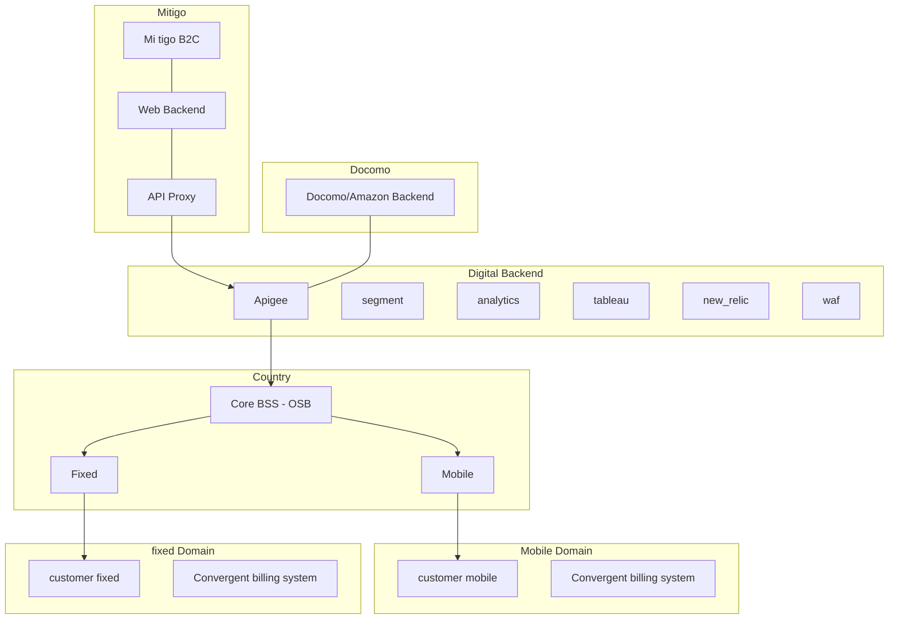
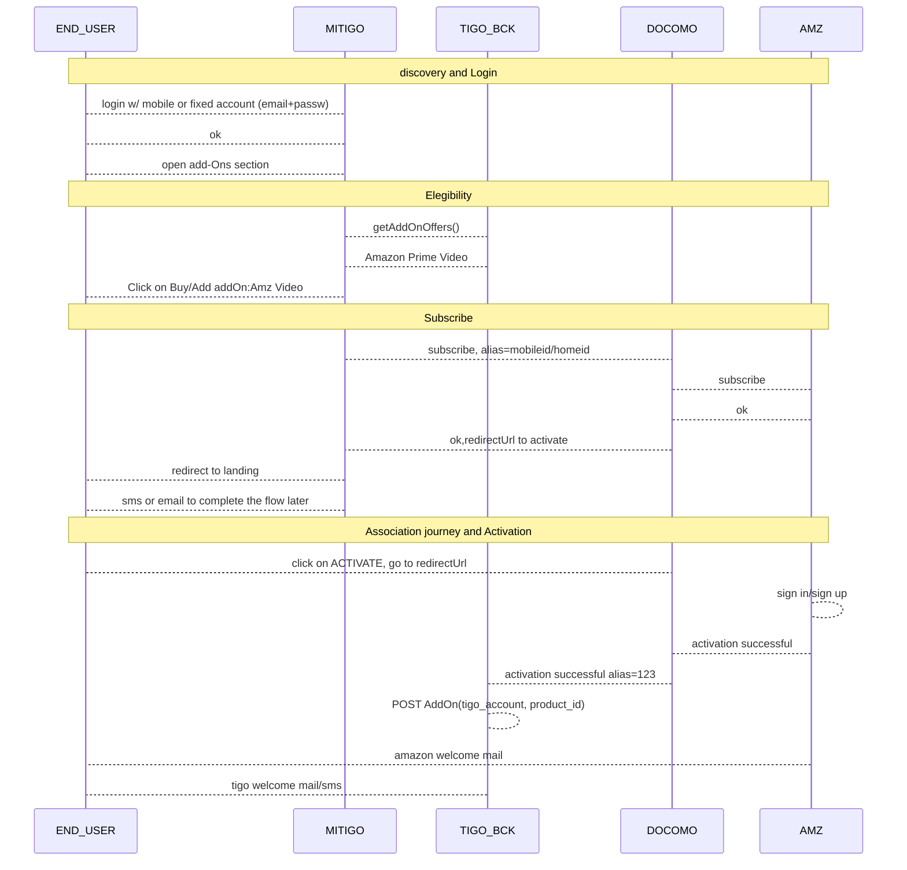
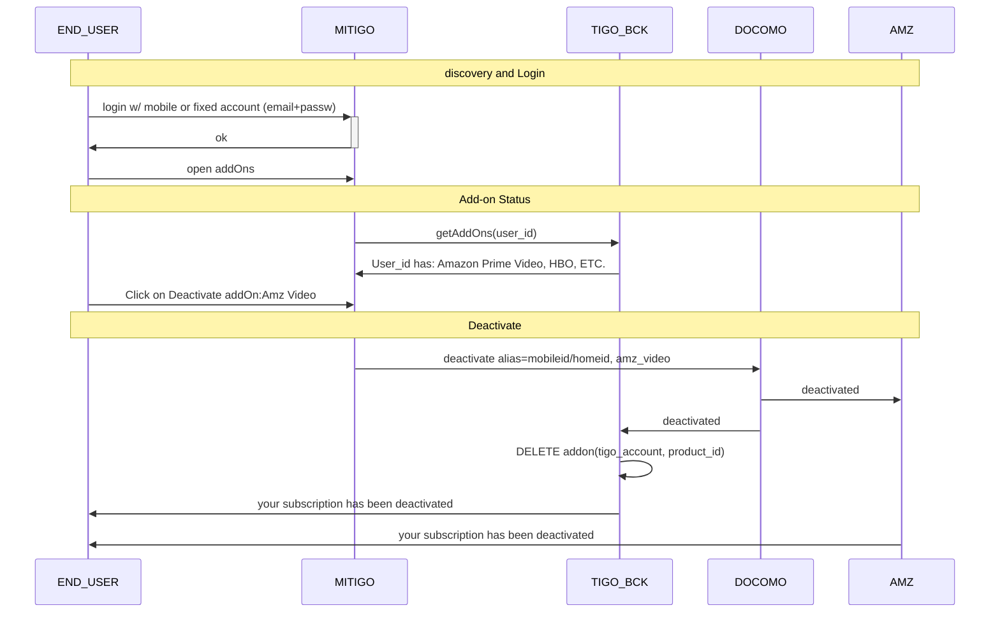

# AMAZON

## Journey

- Audience: B2C end customer
- Journey: Subscription - Mobile + Home
- Type: Partners and OTTs

## Description

Add-On for mobile and fixed services.
Products: Prime Video and Prime Music.

Commercialization: 
- Hard bundle (included in your plan, cost 0)
- Add-on (user can activate and pay x$/month until deactivation, like HBO)

## Goals and KPIs
In order to track success of the campaign we shall review on a monthly basis the following KPIs:

* Sales (# of customers agreeing to buy Amazon)
* number of associations made by customers and % of agreed sales
* number of subscribers with Amazon add-ons:
    - in 3 month free period
    - Paying for the add-on
* Penetration of postpaid base

## Features
- Self-service (using mitigo b2c)
    - MOBILE Add-ons
        - Get add-on offers (catalog)
        - Get current add-ons by msisdn
        - Add add-on (subscription)
        - Terminate add-on (unsubscribe)
    - HOME Add-ons
        - Get add-on offers (catalog)
        - Get current add-ons by homeid
        - Add add-on (subscription)
        - Terminate add-on (unsubscribe)
- By Agent (using mitigo-agent or CRM and Docomo reports)
    - MOBILE Add-ons
        - Get add-on offers (catalog)
        - Get current add-ons by msisdnd
        - Add add-on (subscription)
        - Terminate add-on (unsubscribe)
    - HOME Add-ons
        - Get add-on offers (catalog)
        - Get current add-ons by homeid
        - Add add-on (subscription)
        - Terminate add-on (unsubscribe)
    - See amazon subscription status w/ Docomo
    - Reconciliation reports (docomo)

- Care & Recommendation
    - FAQ pages with:
        - terms and conditions
        - pricing
        - what to do when problems arise

## Basic architecture


## Flows
More information on flows from [docomo apis](https://drive.google.com/file/d/1PPU5YNCoKs31-29OGS2GZd_URpw9F4px/view?usp=sharing) and [docomo flows](https://drive.google.com/file/d/1h9PCTQkJamHGTKkX2VSPYL7ek_EFqJ1m/view?usp=sharing).

Mi tigo mockups: https://projects.invisionapp.com/share/9C8H21I3R
Tigo activation flow: https://invis.io/65LX4R9NE7S

### Activation



### Termination
This flow can begin on:
- end user
- tigo
- amazon

Here we describe the flow from the end_user.
Agents may use mitigo-agent. Amazon flow doesn't require user interaction.

On plan migration, early churn or change number user will be disconected thru APIs and needs to begin the association flow again with the new number. This process will be manage by the country.

Tigo deactivation flow: https://invis.io/65LX4R9NE7S




## Implementation Details

Refer to [mitigo](mitigo.md) for details. Here only specific services/details for AMZ.

### Exposure layer
- apigee
    - tigo_home_xx_portfolio_vx
    - tigo_mobile_xx_plans_vx
    - zendesk_tickets_v1
    - docomo_amz_v1 

- Country API Details:
    - [Home Get Offerings](https://homeselfcareapi.docs.apiary.io/#reference/0/v1tigohomecountryportfoliocontractscontractidproductsproductidavailableoffers/get-available-offers-by-contractid-and-productid)
    - [Home Add offering](
https://homeselfcareapi.docs.apiary.io/#reference/0/v1tigohomecountryportfoliocontractscontractidproductsproductid/add-offering-by-contractid-and-productid)
    - [Home Get add-ons by homeid](
https://homeselfcareapi.docs.apiary.io/#reference/0/v1tigohomecountryportfoliocontractscontractidproductsproductid/get-product-by-contractid-and-productid)
    - [Home Delete add-on by homeid](https://homeselfcareapi.docs.apiary.io/#reference/0/v1tigohomecountryportfoliocontractscontractidproductsproductid/delete-offering-by-contractid-and-productid)
    - [Mobile Get Offering](
https://mobileselfcareapi.docs.apiary.io/#reference/0/v2tigomobilecountryplanssubscribersmsisdnavailableoffers)
    - [Mobile Add offering](
https://mobileselfcareapi.docs.apiary.io/#reference/0/v2tigomobilecountryplanssubscribersmsisdnacquiredoffersofferid/purchase-offer-by-msisdn-and-offerid)
    - [Mobile Delete offering](
https://mobileselfcareapi.docs.apiary.io/#reference/0/v2tigomobilecountryplanssubscribersmsisdnacquiredoffersofferid/delete-offer-by-msisdn-and-offerid)

- Docomo API details:
Based on [docomo documentation](https://drive.google.com/file/d/1PPU5YNCoKs31-29OGS2GZd_URpw9F4px/view?usp=sharing)
    - Subscribe flow - chapter 13 state machine (SUBSCRIBE > CONFIRM)
    - Subscription deactivation API - chapter 12
    - GetAll API - chapter 14

- zendesk  
    - [Create ticket](https://developer.zendesk.com/rest_api/docs/core/tickets#create-ticket)


### Engines / Enablers
- zendesk
    - FAQ
    - backoffice queues for activation/deactivation

### Marketing tools
- outbound/hubspot?

### Repositories
- Docomo SFTP/activations: layout defined on [docomo documentation](https://drive.google.com/file/d/1PPU5YNCoKs31-29OGS2GZd_URpw9F4px/view?usp=sharing) chapter 15

Example:
```
"countryCode","siteCode","productName","subscriptionCode","msisdn","alias","telcoCode",
"dateCreated","dateActive","datePendingUnsubscription","dateUnsubscribed",
"unsubscriptionSource"
"XX","amazon","plan123","5b23765be4b06e7171d79c7d","+1234567890",,"OPERATOR1",
"2018-05-22T15:31:06Z","2018-05-22T15:45:31Z",,"2018-06-29T15:45:31Z ",
"TELCO"
```

- Country/add-ons: report on manual activations on siebel. 


### Other tools
- segment
- new relic
- tableau, dashboard amazon
    - activations, deactivations by product/country
- analytics
    - mixpanel (by mitigo)

# Tasks and timeplan

## On country
- Add-on creation (new SKUs) with different price point for hard-bundles and add-ons
    - mobile 2 skus: cost 0, cost x$
    - home 2 skus: cost 0, cost x$
- Plan mapping configurations using these SKUs
- APIs for:
    - MOBILE Add-ons
        - Get add-on offers (catalog)
        - Get current add-ons by msisdn
        - Charge add-on (subscription)
        - Terminate add-on (unsubscribe)
    - HOME Add-ons
        - Get add-on offers (catalog)
        - Get current add-ons by homeid
        - Charge add-on (subscription)
        - Terminate add-on (unsubscribe)
- File: Subscription Eligibility file-based interface (docomo chp 7)
- File: deactivations, early churn.
- Processes for:
    - Queues for activations/deactivations on zendesk (in case activate/deactivate api is not available)
    - Reconciliation
    - Marketing plan details
    - Troubleshooting
    - Scalation matrix

More information on API Details [here](https://docs.google.com/spreadsheets/d/1If44LgO5MjK2zj51elfwepbGLaLprfejUq0JrjXjSXg/edit#gid=0)

## On Digital
- PRD. Ivan 
- UX experience. Nemo
    - Mobile
    - Home
- API mapping & exposure in apigee. Beni + Edge
    - Country API Details:
        - Home Get add-ons offers
        - Home Add add-ons
        - Home Get add-ons by homeid
        - Home Delete add-on by homeid
        - Mobile Get add-ons Offering
        - Mobile Add add-ons by msisdn
        - Mobile Delete add-ons by msisdn
        - Mobile Get add-ons by msisdn
    - Docomo API details:
        - Subscribe flow - chapter 13 state machine (SUBSCRIBE > CONFIRM)
        - Subscription deactivation API - chapter 12
        - GetAll API - chapter 14
    - zendesk  
        - Create ticket
- Zendesk: workflow and reports
- Segment: update instrumentation plan
- tableau: build dashboard for amazon
- Unit testing
- Integral testing
- Deploy
