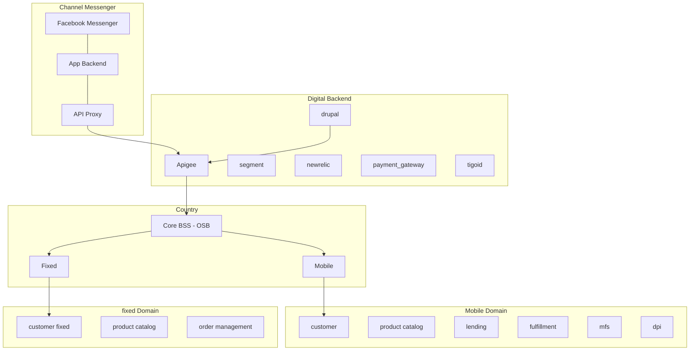

# BOT

**Journey**
Audience: b2c end customer
Transaction & Subscription - Mobile + Home

**Description**

ticket deflection

**Goals and KPIs**
- active users
- ticket deflection
- satisfaction (nps)

## Features
- mobile Login sms otp, change msisdn
- home login contrato y documento
- Use & Self-service
    - See Balances
    - See Quota
    - Top-up
    - Show current plan
    - Locations
    - Buy Pack
    - Loans
        - current debt & credit limit
        - loan balance
        - loan packs
    - View/Buy Subscriptions (Add-Ons)
        - core balance
        - mfs
    - Last Invoices
    - Pay invoice
        - CC/DC
- Care & Recommendation
    - Zendesk FAQ integration
    - NPS
    - Help
        - create ticket to zendesk
        - bot on zendesk

## Basic architecture

## Implementation Details

### Authentication
- tigo id
    - TigoID Public

### Exposure layer
- apigee
    - Tigo Mobile Upselling Info
    - Tigo Lend APIs
    - Tigo Mobile Product Fulfillment
    - TigoMoney Payment
    - TigoMoney AccountStatusService
    - Selfcare Api V2
    - BSS Product
- kinesis

### Engines / Enablers
- payment gateway
- evam
    - lifecycle campaigns
    - broadcast
    - upselling (exacaster)
- zendesk

### Marketing tools
- digital turbine
- push notifications
    - pushwoosh
- kannel
- yourls
- attribution tools
    - tune
    - appflyer

### Repositories
- redshift
- BaaS
- Convergent DB
- S3

### Other tools
- segment
- new relic
- tableau
    - dashboard tigo shop
    - active users
- analytics
    - mixpanel
    - google analytics
    - facebook analytics

## SOUTH ARCHITECTURE (COUNTRY)

### Data services
- exacaster
    - nbo prepaid
    - nbo pospaid

