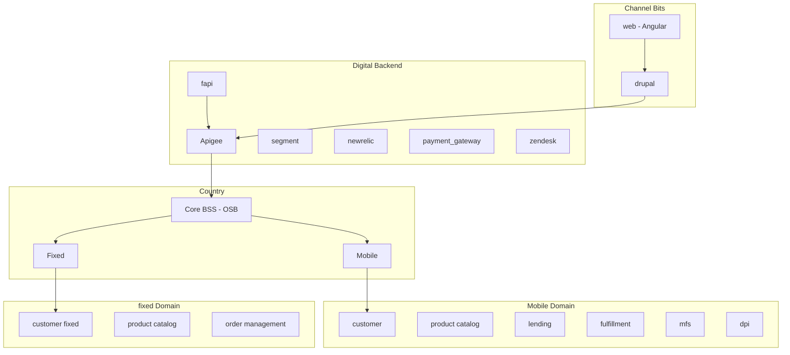

# Mi Tigo B2C

**Journey**

Journey: Subscription, Use - Mobile + Home
Audience: agents

**Description**

Same as Mitigo B2C but some additional cards for Agents that users may not see

**Goals and KPIs**
- agents performance
- transactions (upsell/retention) amount and money

## Features
Only differences from Mi Tigo

- Login from Zendesk
- Login from Siebel
- Login with LDAP

- Customer Profile
- Product Catalog
- Customer Consumption
- Insights
- Upsell
- Retention
- Renewal

## Basic architecture

## Implementation Details

### Authentication
- tigo id
    - TigoID Public

### Exposure layer
- apigee
    - Tigo Mobile Upselling Info
    - Tigo Lend APIs
    - Tigo Mobile Product Fulfillment
    - TigoMoney Payment
    - TigoMoney AccountStatusService
    - Selfcare Api V2
    - BSS Product
- kinesis

### Engines / Enablers
- payment gateway
- evam
    - lifecycle campaigns
    - broadcast
    - upselling (exacaster)
- zendesk

### Marketing tools
- digital turbine
- push notifications
    - pushwoosh
- kannel
- yourls
- attribution tools
    - tune
    - appflyer

### Repositories
- redshift
- BaaS
- Convergent DB
- S3

### Other tools
- segment
- new relic
- tableau
    - dashboard tigo shop
    - active users
- analytics
    - mixpanel
    - google analytics
    - facebook analytics

## SOUTH ARCHITECTURE (COUNTRY)

### Data services
- exacaster
    - nbo prepaid
    - nbo pospaid

