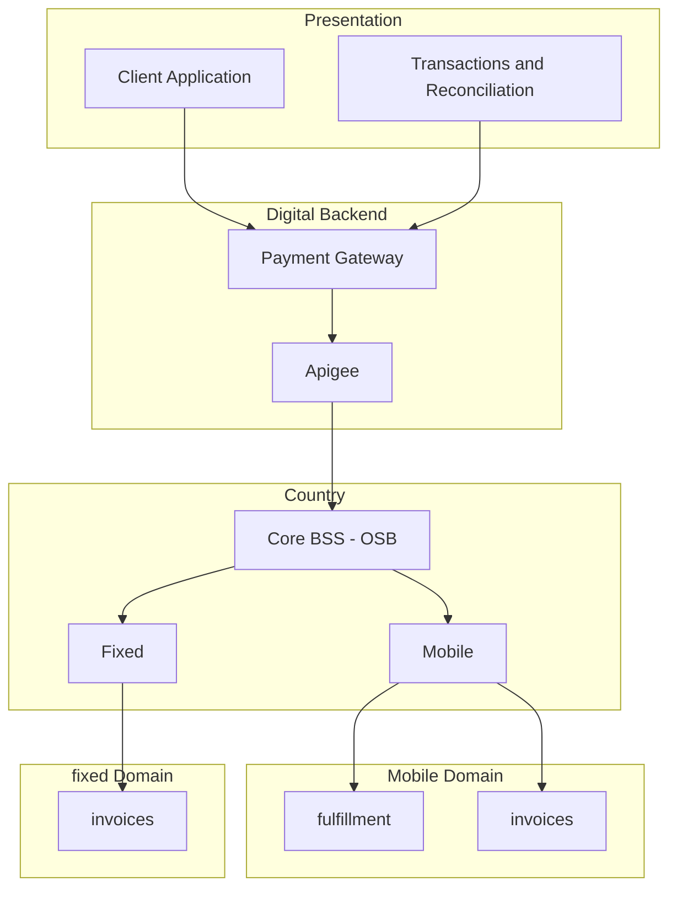

# Payment Gateway

## Journey

Enabler - Mobile + Home
audience: developers

## Description

Allow payments with Credit / Debit Cards
Fulfillment

## Goals and KPIs
- Credit Card Payments (#)
- Debit Card Payments (#)
- Tokenized Card (#)
- Accounts Paid

## Features
Payments
- Pay on Demand (no fulfilment)
- Pay + fulfillment
- Tokenization
- Pre Authorizations
- Use of html helpers
- Autopay

Fulfillment
- Pay Tigo Bills
- Top-up Tigo (recharge)
- Pay On Demand

Management
- Transactions and reconciliation Reports

## Basic architecture

## Implementation Details

