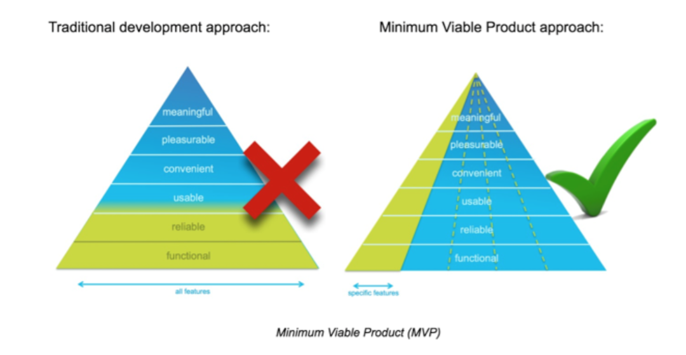
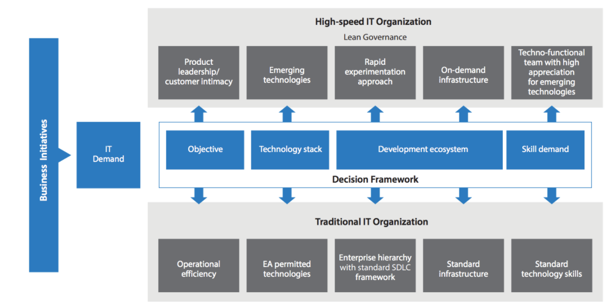
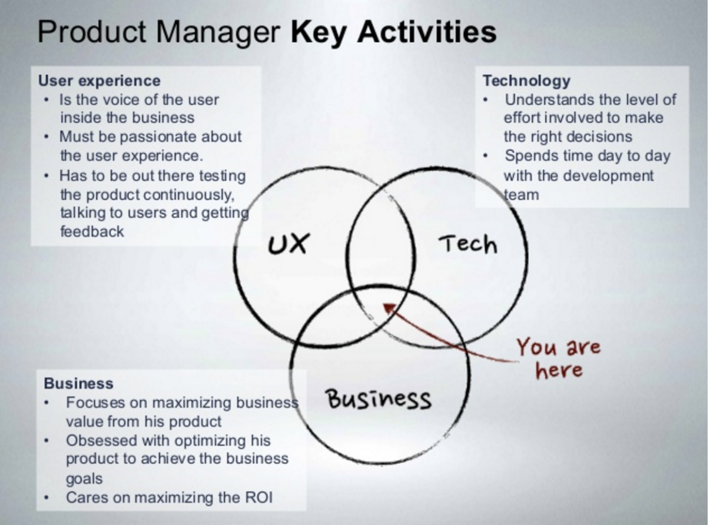
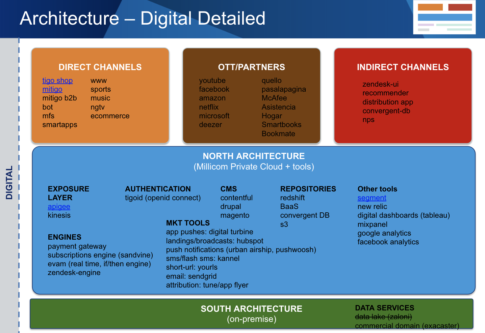

# Development Best Practices

In thesede sections we share all the best practices we have gathered over time, and should be followed by developer partners to ensure the timely and effective management of the development our Digital Assets.

**Key concepts to discuss here:**

- Basic concepts:
    - Minimum viable product
    - Key attributes of any digital product: VIABLE, STABLE and MEASURABLE
    - Agile development
    - 2 speed it

- Millicom’s digital team: who does what 
- Millicom’s digital team: tools
- Process and guidelines
- What to expect from Millicom
- What we expect from a Development Partner
- Millicom’s digital Architecture

## Basic Concepts
### MVP

In product development, the minimum viable product (MVP) is a product with just enough features to gather validated learning about the product and its continued development. Gathering insights from an MVP is often less expensive than developing a product with more features, which increase costs and risk if the product fails, for example, due to incorrect assumptions.

**Purposes**

- Be able to test a product hypothesis with minimal resources
- Accelerate learning
- Reduce wasted engineering hours
- Get the product to early customers as soon as possible
- Base for other products
- To establish a builders abilities in crafting the product required

All millicom’s digital products begins as a MVP. See [our process](https://docs.google.com/document/d/1BJ110K93gfvklwE8pias8qD8IOnwUK_CyisyjqczyAo/edit?usp=sharing) to understand the process. 

If you feel that our requirements surpass this definition.. challenge it!

**Key attributes**

Any successful product (even MVPs) MUST have clear Goals and KPIs before starting. 
After that, must comply this 3 attributes:

- VIABLE
- STABLE
- MEASURABLE

If the goals are not well defined or any of this attributes cannot be guaranteed because poor definitions, missing building blocks or not stable enough.. we should not start a new project.

#### Agile development

All digital products should be develop using iterative and agile methodologies. 
This means:

- Have defined goals and scope in each sprint
- Duration: short sprints (if something takes +3 months probably it is oversize)
- Involve all people required to complete the task (functional, technical, support)
- Using tools to support communications, issues and decisions
- Maintaining regular meetings to track progress

For more info on our process see [our process](https://docs.google.com/document/d/1BJ110K93gfvklwE8pias8qD8IOnwUK_CyisyjqczyAo/edit?usp=sharing)

### 2 speed it

Digital development requires usually different approach than traditional IT organizations. Figure shows basic differences

In MILLICOM for all digital properties we expect a lean governance and a rapid experimentation approach. 

## Who does What

Roles at MILLICOM:

- PRODUCT MANAGER  (WHAT, WHY): takes care of functional requirements, maximizing value and growth. Responsible for budget allocation and ROI 
- PRODUCT DEVELOPER (HOW, WHEN): takes care of UX and TECH decisions to build the product. Discuss with PM about the goals, kpis and strategies to get them. Main point of contact with partner’s dev team and countries IT teams.
- INFRA, OPERATIONS AND MAINTENANCE (WHERE, AFTER-CARE): owner of enablers and responsible for cloud infrastructure and release management.
- PMO: (when required) administratives, follow project milestones and budget execution. Info consolidation for other areas.

In PARTNER’s side we expect at least:

- TECH LEADER. to work with PD in day to day activities
- ACCOUNT MANAGER. to work with PM on sow analysis, quotes, disputes, SLAs

## What to expect from Millicom 

- Title, descriptions, goals and KPIs of the product
- List of user stories (JIRA project)
- List of APIs, basic documentation of each of them (postman collection)
- Basic wireframes or mockups of those user stories (photoshop, invision, .. ) good enough to understand the scope of work and quote. These mockups may evolve   with dev partner’s help later. 
- Beta, RC unit and integral testing.
- Release management.

## What we expect from a Dev Partner

- Expertise in your area
- Provide a lot of input in the product definition & fine tuning based on your previous experience
- Candid: if something is poorly defined or it is not working as expected, avoid committing dates and results.
- Accountability: Once delivered, all products must comply agreed functional and nonfunctional requirements within a normal expectation (there is no bug-free software, but we can tell when nobody is taking care of basic stuff). If there is some known restrictions due lack of information or poor API performance, let us know early to avoid surprises.
- Post-delivery support. After delivering the product we expect support and SLAs in place to work with our NOC.
- Expertise with automated testing (Test Driven Development) - Depending on the project we prefer if partners implement automated testing for all their projects, this with the purpose of simplifying and expediting integration testing of new versions in the future. This applies for projects in Mobile APPs, web and backend applications.
    - We are ok using any of the tools in which the partner has expertise

- Expertise in continuous integration - Automation of some of the delivery tasks are preferred, with the purpose of improving efficiency and accountability for changes to the code we develop. 
    - We are ok using any tools with which the partner has expertise.

- Maintenance of Dev, QA, Stage and Production environments - allowing for simple dev process and UAT acceptance.

## Tools

- For day to day communication: slack, mail
- SoW and project documentation: JIRA. Shared folder with necessary documents when required
- Issue management: JIRA
- Rest API client: postman
- API documentation: apiary.io
- Live mockups: invision
- digital assets: adobe illustrator, photoshop

## Processes and Guidelines
- Marketing and visual guidelines
    - [SMART-StyleGuide-v08.pdf](https://www.dropbox.com/home?preview=SMART-StyleGuide-v08.pdf)
    - [TIGO-StyleGuide-v05.pdf](https://www.dropbox.com/s/484lnyk2t5q108l/TIGO-StyleGuide-v05.pdf?dl=0)
- Card model and inventory:
    - SelfCare_Master_Cards_Design_v06_CS6.ai
- [Digital Best Practices](https://docs.google.com/document/d/1BJ110K93gfvklwE8pias8qD8IOnwUK_CyisyjqczyAo/edit?usp=sharing). Audience: countries and other millicom areas

- [Tigo REST API Exposure Guidelines](https://docs.google.com/document/d/14XYepD-C6Thv0EGe5osIS7iT02hIEPTS-KZhbkidCyE/edit?usp=sharing)
. Audience: countries and developer partners that needs to expose a new API thru apigee
- [New starter procedure](https://drive.google.com/file/d/0B7I5WdHOWo03Zkx5NkRMOGFwTW8/view?usp=sharing). Audience: dev group from software factory

- [Change management Process](https://drive.google.com/file/d/0B7I5WdHOWo03OHNONUJ4eWJoVk0/view?usp=sharing). Audience: dev partner who needs to publish products in our cloud infrastructure

- [Security  SSDLC checklist](https://millicom-my.sharepoint.com/personal/jennifer_torres_millicom_com/_layouts/15/onedrive.aspx?e=5%3a4b0295f342f7485f84724c23e2ab3c51&id=%2fpersonal%2fjennifer_torres_millicom_com%2fDocuments%2fSecure+SDLC&FolderCTID=0x012000EB70FABAF2D97A44A4E8D49556294999)

## Millicom’s Digital Architecture
There are basically 3 layers. 

- Country layer: includes middleware and all local legacy platforms (Billing, Rating, CRM, field services, etc.) - manage by IT from countries
- Digital Cloud layer: includes enablers and digital infra to support rapid app development and shared resources. - manage by DIGITAL REGIONAL team
- Partners & Apps layer: touchpoints with consumers in their digital journey. Developed with DEV PARTNERS and supported by DIGITAL NOC team. Direct channels is for end-customers, indirect channels for our agents/retail, ott/partners are for other integrations and digital partnerships or subscriptions.

For more information see [catalog](../catalog.md)

### CLOUD LAYER details:

- APIGEE: api exposure layer. developers onboarding
- EVENT SERVER (AWS KINESIS): real time streams
- AWS: Amazon web services. Infrastructure as a service.
- TIGOID: enabler for authentication (openid connect) 
- TABLEAU: BI tool. Dashboards
- REDSHIFT: cloud database
- S3 BUCKETs: file repository
- ZENDESK: knowledge base, ticket management, chat
- LOTUS FLARES: passes (app by app)
- DIGITAL TURBINE: push apps 
- DIGITAL CAMPAIGN MANAGER: real time engine for inbound and outbound campaigns. omnichannel