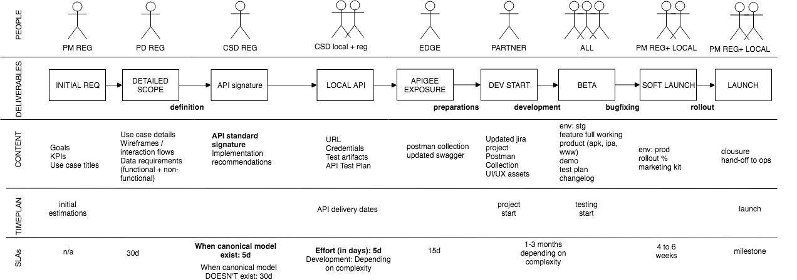

# Digital Development Life Cycle

In these sections we share the best practices we have gathered over time, and should be followed by us to ensure the timely and effective management of the development our Digital Assets.

## Development life cycle

To edit use [source file](https://drive.google.com/file/d/1TF3A6RhBbaPfOeIWik9BDQ44-ZXNxBEs/view?usp=sharing)

-  Product manager (PM functional leader) gather stakeholders requirements and defines the goals, kpis and use cases titles (what and why)
-  Product developer (PD technical leader) uses this input to build the PRODUCT REQUIREMENTS DOCUMENTS (PRD) including flows, wireframes and mockups, data requirements and others. (how)
- PD shares with CSD the PRD. CSD will provide the API canonical signature and implementation recomendations. 
- PD accepts the signature and sends it to every country. CSD-LOCAL takes the requirement and provides an effort estimate (SLA: 5 days) depending on complexity
- When ready, CSD-LOCAL provides the signatures including: url, credentials, test data and api documentation (including error codes)
- PD accepts the apis, and expose them in apigee (using a certified partner). Deliverables: swagger for documentation, postman collection for testing. SLA: 15d
- PD and PM agrees with Development partner the Scope of Work
- DEV starts development and provides dates for full beta delivery, including updates on the thread model.
- DEV delivers the beta and DIGITAL (reg+local) start testing and bugfixing
- In these step the vulnerability assesment or static code analysis for security issues may be iniciated.
- COUNTRY accepts Release candidate and publish the product/feature.

## The roadmap

All projects will have at least 3 milestones
- START DATE: DEV start development
- TESTING DATE: DEV delivers a full beta and testing and bugfixing begins
- LAUNCH DATE: commercial rollout for +50% of elegible user base

Notes: Some projects may have these additional milestones depending on the complexity/requirements

- API DELIVERY DATE: date when api/requirements will be ready
- SOFTLAUNCH / CANARIES: some rollouts will have a limited scope for only some users to discover early bugs

All dates are included in our portfolio mgmt tool and discussed monthly

## The checklist

### Artifacts:

- PRD
    - objetives
    - kpis
    - use cases titles
    - Mockups and digital assets
- Security:
    - Thread model
    - Vulnerability assesment
- Instrumentation/Reporting
    - Instrumentation Plan
    - Dashboard / ETL requirements
- Engineering:
    - Postman collection
    - Swagger
    - architecture diagrams (when necessary)
- Project:
    - JIRA project
    - Roadmap entry
- Marketing:
    - WWW and SEO
    - FAQ on zendesk
    - On apps: Store entry (logos, descriptions, tags, etc)

### Steps 

IDEA  
- Define Goals 
- Define Target 
- Define KPIs 
- Identify Risks   
- Identify Project Team   
- Define Scope   
- Identify Pilot Country   
- Complete PRD   
- Obtain Digital Officer Approval  

PLANNING  
- Define Architecture
- Establish Jira Project
- Create mini business case
- Create Test Prototype/Flows
- Obtain quotation and time plan from vendor
- Obtain budget approval (CAR id or PO) Obtain BU Validation/Approval

DEVELOPMENT  
- Create environment setup   
- Develop threat model   
- Define Localization   
- Regression Testing   
- Create Marketing Kit   
- Perform Vulnerability Assessment   
- Obtain Country Approval to Launch   

LAUNCH  
- Hand-off to O&M   
- Hand-off to Growth   
- Execute Postmortem   
- Revisit Product Backlog

