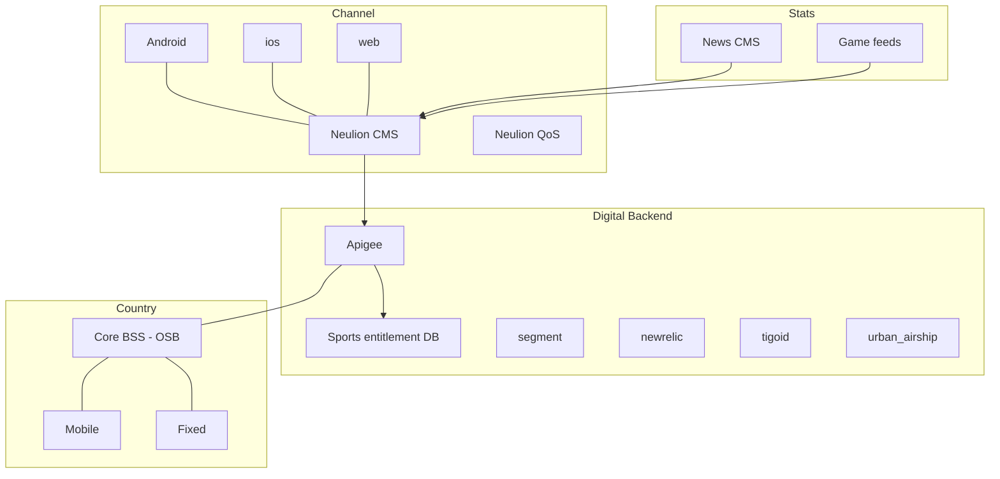

# Tigo Sports

## Journey

Transaction - Mobile + Home. Audience: b2c end customers. Some countries OTT customers

## Description

Watch live games and VOD for main local leagues. 2nd screen for home users.

## Goals and KPIs

- active users
- streams: number of streams, number of minutes
- passes sold

## Features

- Login
    - MOBILE. Login with HE or sms otp
    - HOME. Login with email + account validation
    - OTHERS. login with email for non tigo customers
- Discovery
    - Highlights: welcome Banner
    - Push notifications
    - Ads: banner + pre-roll
- Use & Self-service
    - Watch game
    - Watch VOD 
    - Read News
    - Follow a team
    - See stats
- Care & Recommendation
    - Share VOD or article

## Basic architecture

## Implementation Details

### Authentication
- tigo id
    - TigoID Public

### Exposure layer
- apigee
    - tigo_sports_v1
    - toolbox_v1
    - toolbox_auth_v1

### Marketing tools
- digital turbine
- push notifications
    - urban_airship

### Repositories
- S3

### Other tools
- segment
- new relic
- tableau
    - dashboard tigo sports
