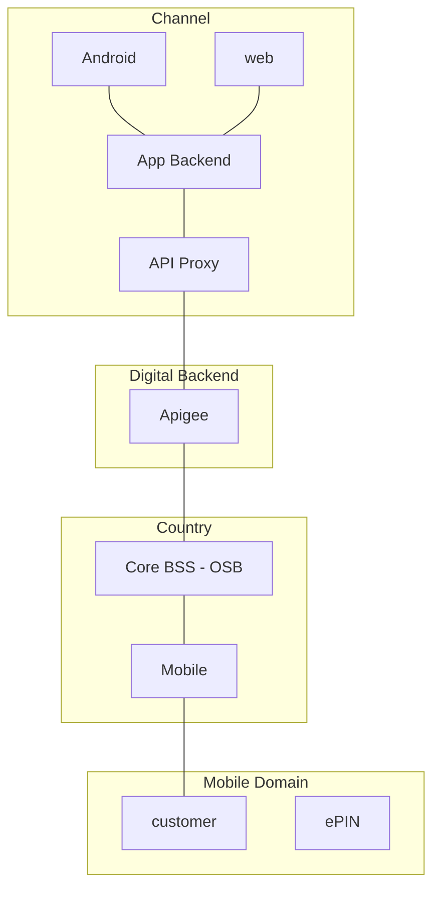

# Tigo USA App

**Journey**

Journey: Transactional - Mobile
Audience: people living in USA doing recharges and paying for services in CAM

**Description**

**Goals and KPIs**
- active users
- transactors

## Features
- Discovery
    - Banner
    - Push notifications
    - Product catalog
- Use & Self-service
    - Buy Pack
        - core balance
        - mfs
    - Loans
        - current debt & credit limit
        - loan balance
        - loan packs
    - Top-up
        - credit card
        - mfs
    - See Balances
    - See Quota
    - Manage subscriptions
    - Internet details
- Care & Recommendation
    - NPS
    - Help
        - chat
        - faq

Promos
Feature products
Product Catalog
Cross links web app
Button in Tigo En Linea (GT)
Login
View Promotions
Top-Ups
Call Contact
Recharge/Auto-recharge
Recharge Acct Balance
Top-up Others
Calls
Customer Care Support
FAQs

## Basic architecture

## Implementation Details

## SOUTH ARCHITECTURE (COUNTRY)

